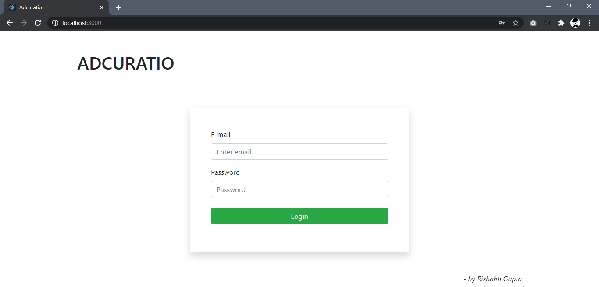

# Getting Started with Create React App

This project was bootstrapped with [Create React App](https://github.com/facebook/create-react-app).

## Available Scripts

In the project directory, you can run:

### `npm install`

Run this command in the cmd in the directory of the project to install all necessary packages for the project to run.

Note: Run the project with proper internet connection otherwise many styles would not work.

### `npm start`

Runs the app in the development mode.\
Open [http://localhost:3000](http://localhost:3000) to view it in the browser.

### `npm test`
Launches the test runner in the interactive watch mode.

### `npm run build`
Builds the app for production to the `build` folder.

## Screenshots

